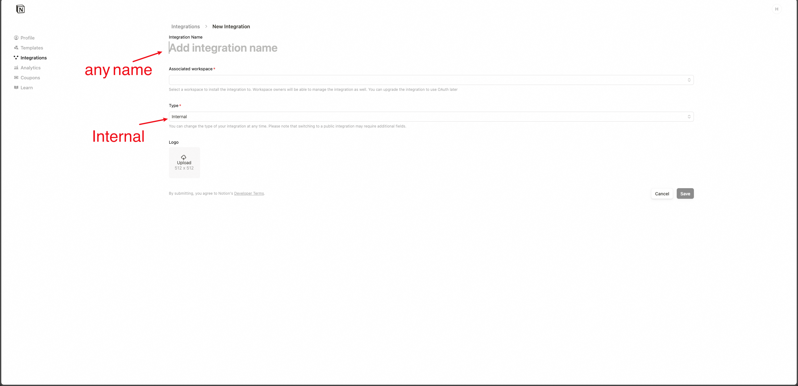

# Notion Hades

<!-- 


 -->


## Features

Blog features

- [x] Blog list
- [x] Blog detail
- [x] Blog search
- [x] Mobile view
- [x] Table of contents
- [x] Social media image
- [ ] Comments

Supported notion blocks

- [x] Rich text
- [x] Mention
- [x] Link
- [x] Divider
- [x] Code
- [x] Book Mark
- [x] h1 h2 h3
- [x] list
- [x] todo
- [x] toggle
- [x] quote
- [x] image
- [x] callout
- [x] paragraph
- [x] Table
- [x] toggle
- [x] mention page
- [x] mention person
- [x] Video
- [x] Audio
- [x] File
- [ ] Database
- [ ] Chart
- [ ] Button

## Demos

- [Post example](https://blog.hacknerd.top/post/1c8985ec-c354-80c8-8eaa-fdc28fabb06e)
- [My Site](https://blog.hackerd.top)

## Requirements

This project require `Node` >= 20.

## Getting Started

Firstly, create `.env` file and set environment variables:

```shell
NOTION_HOME_PAGE_ID=<your Home Page Id>
NOTION_DATABASE_ID=<your Database Id>
NOTION_API_KEY=<your Internal Integration Secret>
```

Wonder how to get these variables? See 👉 [How to get Env Variables](#how-to-get-env-variables).

Secondly, run these command:

```shell
> npm install
> npm run dev
```

Then, open [http://localhost:3000](http://localhost:3000) with your browser to see the result.

## How to get Env Variables

First, click 👉 [Notion hades template](https://aback-degree-5d2.notion.site/Notion-Hades-1ac985ecc354807192a4fa16c65409a5?pvs=4) to copy **_notion hades template_** to notion database.

Secondly, follow this documents [https://developers.notion.com/docs/authorization](https://developers.notion.com/docs/authorization) and then visit 👉 [https://www.notion.so/profile/integrations](https://www.notion.so/profile/integrations) to create a new integration.



Thirdly, click integration you created, and copy to get your `Internal Integration Secret`


And then, go to your notion database, and connect your integration to notion database.


Last but not least, get `Home Page ID` and `Database ID` from share link.


You should get some thing like this:

```plain text
https://www.notion.so/<your Home Page Id>?v=<some hash>&pvs=4

or

https://aback-degree-5d2.notion.site/Notion-Hades-<your Database Id>?pvs=4
```

## Deploy on Vercel

You can deploy your app with Vercel. Remember to set `NOTION_HOME_PAGE_ID`, `NOTION_DATABASE_ID` and `NOTION_API_KEY` in Vercel environment variables.

You can check out [Next.js deployment documentation](https://nextjs.org/docs/app/building-your-application/deploying) for more details.
